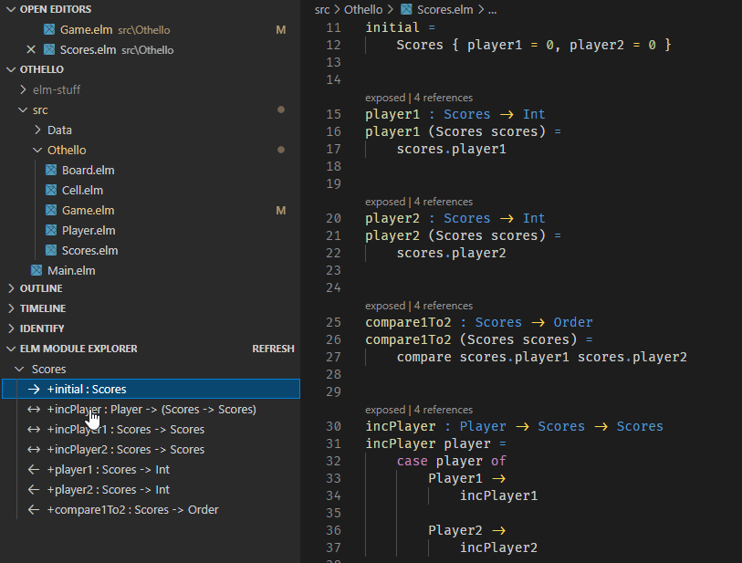

# Overview

Display a _type oriented_ organization of functions in the _current_ module file.

- Functions related to types declared in the current file are grouped by type. For each type, functions are sub-divided into functions that
  - ➡️ Returns the type.
  - ⬅️ Includes the type as an input value.
  - ↔️ Includes the type in both input and output positions (potential type updater).
  - 👁️ A function that simply includes the type. For example, (Widget -> Int) -> Int -> Bool does not really have Widget in an input position in that a Widget will not be provided to the function. Instead the function accepts another function which takes a Widget which means that internally the outer function will need to provide the Widget to the inner function. It is truly dizzying.
- Functions with no signature (though hopefully you will not have occasion to see this 😉).
- Functions related to types declared in other modules.

## Philosophy

This extension can be used to simply visualize module organization and quickly navigate between functions in the current file.

However, the deeper hope is that this presentation facilitates type oriented thinking; conversely avoid 'function soup'. Strong coherence reduces cognitive overhead when reading code and, in my experience, analysis paralysis when authoring new code. This extension groups functions by type to get developers thinking about behavior in the "orbit" of types. This may sound a little like an OO concept. Many of the _beneficial_ conceptual tools offered by Object Oriented development can be applied to Functional Programming.

- Constructors are simply functions that return the type (or values in the case of an `empty`). Naturally Smart Constructors might return the type wrapped in a Maybe or Result.
- Getters are functions that take the type and return a value ex. `Widget -> Int`.
- Methods that query the object given some arguments but which do not mutate it can be thought of as functions with N arguments, then the type in the last position ex. `Int -> Widget -> String`
- Methods that mutate the state and return nothing (void) are functions that take N arguments, then the type in the last position, and which return the updated type ex. `Int -> Widget -> Widget`.
- Methods that mutate the state and also return a value are functions that take N arguments, then the type in the last position, and which return the updated type along with additional result ex. `Int -> Widget -> (Widget, Bool)`. Alternately, if using a State library this translates very naturally to `Int -> State Widget Bool`.
- Composition occurs in functional data structures so no translation necessary.
- Generalization and Realization occur in languages with type classes (not Elm).
- And so with all of that it is also possible to use UML to diagram a functional code base. UML is a Unified Modeling Language. The word 'Class' in 'Class Diagrams' is often **narrowly** interpreted by _tool vendors_ to mean Object Oriented classes, but is more general in official specifications.
